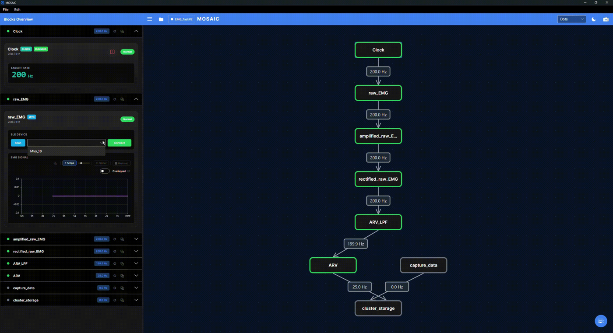

# Myo Armband

[Block Catalogue](../block-catalogue.md) / Devices

Tick-driven BLE source for the Thalmic Myo armband: dequeues one BLE EMG sample per tick and decodes 8 signed bytes through a 256-entry LUT.

## Input and output

| Property | Value |
|---|---|
| **Type** | `myo`, `mosaic.models.myo` |
| **Inputs** | exactly 1 — a tick source, normally a `ClockBlock`; the sender is never inspected |
| **Consumes** | one tick per `OnReceive`; the payload is ignored. EMG bytes come from `BleDevice.DequeueBuffer` |
| **Publishes** | `Vector<double>` (MathNet `DenseVector`) of exactly 8 channels, `(sbyte)b / 128.0` in [−1.0, +0.992] |

## Parameters

| # | Name | Type | Default | Meaning |
|---|---|---|---|---|
| 0 | MyoName | string | `null` | Case-insensitive substring filter applied to BLE scan results only; never validated |

The palette calls this `DeviceName` while the property is `MyoName` — cosmetic drift.

## Requirements and use

Scan and connect the armband from its card, then start the upstream Clock. The clock pumps buffered EMG samples; Bluetooth connection alone does not run that pipeline.

1. Open the Myo block's card in Blocks Overview and find **BLE DEVICE**.
2. Use **Scan**, select the intended armband from the results, and press **Connect**.
3. Check that the device reports a connection, then start the upstream Clock.
4. Show the scope and check for changing EMG values before interpreting downstream results.

This desktop teaching screenshot locates the connection controls. The device is
not connected yet; a rate label on the graph is not evidence of fresh sensor data.
The device name shown is an example, not a name you need to enter.

For parameter positions and connection rules, see [Pipeline Configuration](../configuration.md).
For capturing output, see [Recording](../recording.md).

## Implementation

[API reference](xref:MOSAIC.Models.Devices.Myo). Model defaults above describe configuration loading; palette hints may expose a subset or select different defaults.
