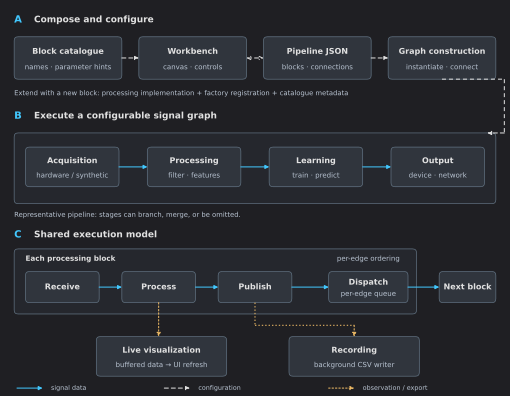

# Core Architecture and the Runtime Model

This guide is for developers implementing blocks or changing graph execution.
For the workbench workflow, start with [Your First Pipeline](first-pipeline.md).

## Architecture at a glance



**A — Composition:** the catalogue supplies available blocks and parameter hints; saved
configurations describe the graph. **B — Execution:** acquisition, processing, learning
and output are representative roles, not mandatory stages. **C — Shared runtime:**
each processing block publishes through its outgoing dispatcher, with ordered delivery
within each subscription. Multiple upstream edges can still call one consumer concurrently.
Plots and recording observe data without becoming mandatory downstream processing stages.

## From configuration to graph

`BlockGraphBuilder.Build` checks connection counts, allowed input classes, missing names,
duplicate edges and cycles before registered block constructors run. It then constructs
valid blocks through `BlockFactory.Create` and connects their upstream publishers.
The result contains both `Instances` and `Failures`. A failed block or connection is
reported and skipped; it does not automatically abort construction of every other block.

Registration belongs in `BlockFactory.ResolveRegistration`. `BlockCatalog` provides palette
descriptions and parameter hints. These are separate responsibilities; both need updating
when adding a block. The factory also attaches recording support.

## The block contract

A processing block derives from `BaseBlock` and implements:

```csharp
protected override void OnReceive(object sender, object value)
{
    // Validate the payload, perform the operation, then Publish(output).
}
```

This is a structural sketch, not a complete block. See [Build Your Own Block](new-block-guide.md)
for an implementation with configuration, validation, registration and export.

Payloads are objects. The receiver must validate the expected data type and dimensions.
The sender identifies the upstream publisher. Publish a new output or a snapshot if the
input is mutable: other subscribers can hold the same input object.

## Delivery and threading

Every block owns an `OutputDispatcher`. Each subscription to that publisher has an
bounded channel (8,192 values by default) and one sequential pump task.

```text
Publisher A → subscription A→C → pump → C.OnReceive
Publisher B → subscription B→C → pump → C.OnReceive
```

Ordering and sequential delivery apply **within one subscription**. The two pumps above
can enter C concurrently. A pump task is not a promise of a dedicated operating-system thread.

| State accessed by | Required approach |
|---|---|
| One upstream pump only | Per-value operations are sequential on that edge. |
| Multiple upstream pumps | Synchronize shared state and take consistent snapshots. |
| A pump and UI commands, device callbacks or timers | Synchronize even if the block has only one input. |
| Processing code and chart controls | Buffer processing results; update bound chart state on the UI thread. |

Input counts are not a complete threading contract. Both the canvas and JSON loader
check connection constraints, but a block must still validate payloads and protect shared state.

For state combining several inputs, update and snapshot under a lock, then release it
before publishing or doing I/O. For a single independent scalar setting, an appropriate
atomic/volatile access pattern can be sufficient. Do not hold a state lock across slow
device operations.

## Publishing and backlog

`BaseBlock.Publish` attempts to enter a per-block lock. If another call to Publish holds
that lock, the **new attempted value is dropped** and the stumbling flag is set.
Accepted values go to the CSV dumper, if present, and to the output dispatcher.

Dispatcher channels are bounded per subscription. If a queue fills, that branch stops
accepting input and reports a fault; already accepted values drain in order. This avoids
silently skipping a gap in a stateful processing algorithm. Resolve the overload and
reconnect or reload the branch before continuing. `QueuedOutputValues` and
`RejectedOutputValues` expose backlog and rejected delivery attempts on the publisher.
These are delivery counts, not necessarily individual matrix rows.

The pump catches subscriber exceptions, logs block identity through the shared logger,
and reports the error on the receiving card before processing the next queued value.
`DownstreamFailures` counts these exceptions on the publisher. Recording has its own
rejected-row counter and non-droppable flush barriers; see [Recording](recording.md).

## Sample rate and output rate

Start with [Data shapes and time](data-and-time.md) for payload meanings and
[Signal Processing Walkthrough](signal-lab.md) for a checked numerical example. The runtime fields carry
metadata; they do not turn an arbitrary payload into a uniformly sampled signal.

| Property | Meaning |
|---|---|
| `DesiredRate` | Expected publication rate, or source pacing where that source uses it. |
| `SignalRate` | Sample rate used by sample-domain processing. |
| `InputRate` | Upstream positive desired rate inherited during receive. |
| `EffectiveSampleRate` | Signal rate, falling back to desired rate and then 1000 Hz. |

### How MOSAIC keeps the two meanings separate

In the signal processing example, the source publishes one sample per tick at 256 samples/s. Sliding Window
groups 256 rows and advances by 64, preserving `SignalRate = 256` while propagating
`DesiredRate = 4`. FFT uses 256 samples/s to locate frequency bins. MAV emits one feature
per window, so its visualization uses four points/s.

Sliding Window initially pads history with zeros and publishes on the first sample.
Subsequent windows advance by stride; early results contain padding.
For contiguous matrix packets, output cadence is sample rows/s divided by stride.
For vector inputs it uses publications/s divided by stride. The
[batched example](data-and-time.md#batches-are-not-necessarily-overlapping-windows)
checks four windows/s from 64 packets/s carrying four rows each, with stride 64.

Ordinary desired-rate propagation fills unset downstream rates. Runtime changes may need
`UpdateAndPropagateRate`, `UpdateAndPropagateSignalRate`, or
`ForcePropagateDesiredRate`. Check the block's override when it changes row meaning or rate.
Blocks that derive their own output cadence override `TransformsPublicationRate`; those
that derive sample spacing override `TransformsSignalRate`. This keeps an upstream rate
change from overwriting the rate chosen by a resampler. A feature block should make its output contract explicit rather than assume inherited
acquisition metadata is the feature sampling rate.

### How the scope plots the data

A block's local visualization is an explicit feed. Sliding Window feeds its input;
MAV feeds its computed feature. Exposing the protected `Visualization` property lets
BaseBlock propagate publication-rate metadata to the bundle.

An explicit visualization sample rate wins. Otherwise the bundle derives its time base
from publication rate multiplied by the rows fed after any bundle-level tail selection.
Automatic publication-rate propagation does not activate tail selection.

For deliberately overlapping matrix feeds, `UpdateSignalRate(256)` and
`UpdateDesiredRate(4)` configure the bundle to keep the last 64 rows of a larger matrix.
That rule applies on every feed, including the first, and does not detect repeated values.
It must not be enabled indiscriminately for device packets or images.

Scope advances by its configured sample period per accepted row. Per-vector throttling,
large-batch reduction, buffer overflow and visibility can remove display data; those
paths must not be treated as lossless acquisition or timestamp reconstruction.
See [Reading the plots](reading-plots.md#display-limits-that-matter) for practical limits,
and [advanced block integration](advanced-blocks.md#give-the-visualization-the-right-rate)
for concrete feed patterns.

## Status and diagnosis

Every accepted call to `Publish` records activity in the block's tick tracker; a call
dropped by the per-block publish lock does not. One shared
`BlockStatusTimer` refreshes all blocks' `Status` and displayed frequency on the UI
thread every 250 ms. This periodic check also detects blocks that stopped publishing.
`BaseBlock` registers automatically and unregisters when disposed; new blocks need
no timer or manual status updates. The shared timer stops when no blocks remain.
It is independent of the chart timer, so pausing plots does not pause status monitoring.
Unchanged diagnostic properties do not emit another notification. Models
must not use it to store validation failures or connection state. `ReportError` stores
`LastError`, logs the problem and displays it separately on the card; `ClearError` clears
it after recovery. Keep manual activity assignments out of block implementations; the
existing observable `Status` property is maintained by `BaseBlock`. Training and connection messages
use distinct properties such as `TrainingMessage` and `ConnectionStatus`. Recording loss
and writer errors also remain separate.

| Status | Interpretation |
|---|---|
| Idle | Insufficient recent published output for the rate estimate. |
| Lagging | Estimated output is below 95% of the desired rate. |
| Normal | The current rate checks pass; this does not validate signal contents. |
| Stumbling | A concurrent `Publish` call was dropped because another publish on this block was still in progress, and that value was lost; inspect the block and log. Processing faults appear in `LastError`, not in this status. |

The estimator needs at least two ticks. Rate-derived checks need a meaningful positive
desired rate; zero-rate metadata does not provide useful inactivity detection.
Timestamps use a monotonic stopwatch anchored to wall-clock time.

## Source lifecycle

Loading a graph does not start every source in the same way:

| Source | Start behavior |
|---|---|
| Clock | Play starts ticking. |
| UDP receiver | Can bind and start receiving during construction. |
| Hardware | Follow its connection and streaming controls. |

Stop sources and remove subscriptions when tearing down or replacing a graph.
`BaseBlock.Dispose` removes its shared status subscription and releases its output dispatcher, dumper and any
resources obtained through `GetOrCreateOwned`, such as the shared card ViewModel; it does not
remove every upstream subscription or dispose arbitrary resources in derived classes.
The graph owner and block owner must cooperate on teardown. Make cleanup idempotent.

## Recording and visualization ownership

`BlockFactory.Create` calls `InitDumper` and `AttachRecording` centrally.
Do not add a second recorder in a new block. Override `PathIsDumpFolder` only when the
block gives `Path` a different meaning, and preserve that meaning through JSON export.

The CSV writer queues stable numeric row snapshots. Its background worker formats CSV
and writes batches. When the bounded queue is full, new rows are rejected and counted;
accepted rows remain in order. See [Recording](recording.md) for the persistence rules
and [Performance](performance.md) for measurement and batch-size guidance.

A `BlockVisualization` must have one explicit owner. Expose it through the protected
`Visualization` property for publish-rate propagation, feed it from processing code,
and dispose it in its owner. The panel manages visibility and pause/resume, not ownership.

## Source reference

- [BaseBlock](xref:MOSAIC.Components.Basics.BaseBlock)
- [OutputDispatcher](xref:MOSAIC.Components.Basics.OutputDispatcher)
- [BlockGraphBuilder](xref:MOSAIC.Components.Factory.BlockGraphBuilder)
- [BlockFactory](xref:MOSAIC.Components.Factory.BlockFactory)
- [TickTracker](xref:MOSAIC.Components.Basics.TickTracker)
- [CsvDumper](xref:MOSAIC.Components.Basics.CsvDumper)

Continue with [Build Your Own Block](new-block-guide.md) or [Visualization Overview](visualisation-architecture.md).
