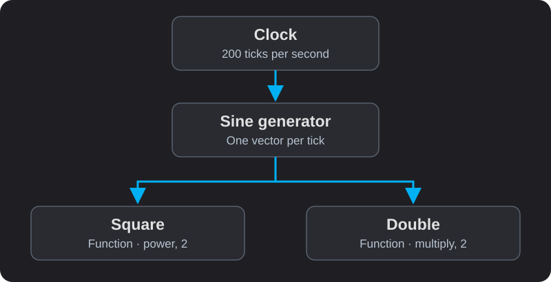

# Your First Pipeline

**Goal:** run a generated signal, inspect two transformations, and save a modified pipeline.
You need a running MOSAIC application; no hardware is required. These steps describe
the desktop workbench. On iOS, use the mobile file picker and controls instead of desktop menus.

For help locating the canvas, palette and block cards, see [Using the Workbench](workbench.md).

## 1. Open the example

Choose **File → Open** or the folder button and open
`Assets/Examples/SevenSteps/01_simple_example.json` from the application's output folder.
The repository copy is under `MOSAIC/MOSAIC/Assets/Examples/SevenSteps`.

You should see four blocks and three connections:



| Block name | What it does |
|---|---|
| `Clock` | Provides 200 ticks per second. |
| `sinusoidSignal` | Produces ten channels of sine waves. |
| `squaredSignal` | Squares each incoming value. |
| `doubledSignal` | Multiplies each incoming value by two. |

Loading constructs the graph. It does not press Play for you. Resolve any missing blocks
or connections reported during loading before interpreting the output.

## 2. Start and inspect the signal

Open the block controls in the left panel, find the **Clock** card, and press **Play**.
Open the sine generator's card and enable its **Scope** plot if hidden.
Open the Function cards to compare their output. Plot visibility does not start or stop processing.

- The sine signal oscillates above and below zero.
- The squared signal is nonnegative.
- The doubled signal has twice the sine signal's amplitude.

The example uses the generator's default frequency of 0.2 Hz, so a full cycle takes
five seconds. Allow enough time to see the shape. Multiple channels have phase offsets;
select a single channel if overlapping traces make comparison difficult.

## 3. Change a parameter

Pause the Clock while editing. In the `doubledSignal` Function card, change the multiplier
from 2 to 3 and apply the setting if the control offers an Apply action. Resume the Clock.
The output should now reach three times the original amplitude.

The equivalent saved block definition is:

```json
{
  "doubledSignal": {
    "Type": "Function",
    "Inputs": ["sinusoidSignal"],
    "Params": ["multiply", 3]
  }
}
```

This is a **configuration fragment**, requiring the named upstream block in the full pipeline.

## 4. Add and connect a block

Pause the Clock. Open the palette in the right panel and find **Negate** under Signal
Processing. Drag it onto the canvas, give it a distinct name, and confirm its settings.
It has no parameters and flips each value's sign.

In the graph's build mode, drag from the sine generator's **output port at the bottom**
to Negate's **input port at the top**. A connection sends the source's output to the target.
Moving a node changes its position, not its connections.

Watch the [port-to-port connection demonstration](workbench.md#connect-it-to-the-data-it-needs)
if you are unsure where to drag.

Resume the Clock. Negate publishes the inverted vector and has no dedicated plotting card.
Inspect its output by [recording it](recording.md) or connecting a compatible downstream
block. For a sine input of `0.5`, expect `-0.5` at Negate's output.

## 5. Save and reopen

Use **File → Save As** to save your own copy, then pause the Clock. Reopen that copy
and check that your multiplier and Negate connection are present. Press Play again.

Saving stores configuration, not every live hardware connection, plot history, or trained
model. See [what saving preserves](recording.md#what-saving-preserves).

## A smaller downloadable example

[Download a complete single-channel pipeline](../examples/first-pipeline.json).
It explicitly sets a 1 Hz, amplitude-1 sine wave, so the squared output ranges from 0 to 1
and the doubled output from −2 to 2.

## Continue

Continue with [Signal Processing Walkthrough](signal-lab.md) to filter a known signal, extract a feature,
inspect a spectrum and record the result. Learn [recording](recording.md), inspect the [configuration format](configuration.md), or
choose an operation from the [Block Catalogue](block-catalogue.md). For a flat plot,
see [Troubleshooting](troubleshooting.md#no-signal-or-a-flat-plot).
