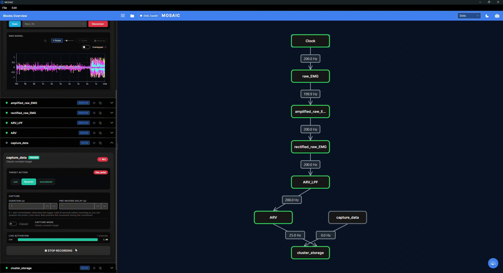

# Train a simple classifier

**Goal:** distinguish two amplitudes of the same synthetic signal. This extends
[Signal Processing Walkthrough](signal-lab.md) with labels, stored training segments and a KNN classifier.
It is a wiring and learning exercise, not a validated gesture-recognition model.

## 1. Open the learning experiment

[Download learning-lab.json](../examples/learning-lab.json). Open it and check that all
nine blocks loaded. The original processing pipeline is unchanged.

| New block | Inputs | Role |
|---|---|---|
| Labels (Trigger) | None | Selects Low = [1,0] or High = [0,1] and starts/stops capture. |
| Training (Trigger Buffer) | Labels, MAV | Stores feature rows paired with the active target. |
| Classifier | MAV, Training | Fits KNN from completed segments and predicts from live features. |

The feature dimension is **1**, because MAV produces one value from our one-channel signal.
The number of classes is **2**. The label's two entries encode the intended class; they
are not extra feature channels. The largest target entry selects the class index.

## 2. Capture the low-amplitude class

1. Start Clock. Set Signal's **Amplitude** to **1**.
2. Wait at least two seconds; check that MAV is near **0.63**.
3. Open Labels, select **Low**, and use **Classic** capture mode.
4. Set capture duration to **5 seconds** and pre-record delay to **0**.
5. Press **Record: Low**. Keep the amplitude unchanged until capture finishes.
   The same button becomes **STOP RECORDING** and closes the segment early.
6. Confirm that Training contains a completed Low segment.

The screenshot shows where to find these controls in an EMG teaching session.
Its gesture names differ from this exercise: select **Low** or **High** in the
downloaded Learning Lab. **Duration** sets the capture length; **pre-record delay**
is the wait before capture begins. A capture button does not establish the device
connection or start the upstream source.

At four feature updates/s, a five-second segment contains about 20 rows, depending on
capture boundaries and scheduling. Capturing raw sine samples instead would violate the
classifier's intended feature meaning even if the channel count happened to match.

The current Classifier in **Buffer** mode retrains automatically when Trigger Buffer
publishes a larger completed-segment count. After only Low, it has not learned the
two-class distinction yet.

## 3. Capture the high-amplitude class

Set Signal amplitude to **3**, wait at least two seconds, and check MAV near **1.90**.
Select **High** in Labels, then capture another five-second segment.
Check that both named segments exist and the classifier reports a trained state.

The first second after an amplitude change contains mixed old/new samples in the window.
Waiting before capture keeps that transition out of both classes. Stop capture before
changing amplitude or label.

The Classifier card provides **Force Retrain** to repeat fitting from the stored segments.
Changing the model with **Apply** can also retrain from the buffer. **Reset Model** clears
the trained classifier state; it does not mean the same thing as clearing captured segments.

## 4. Evaluate on fresh data

Leave capture stopped. Alternate amplitude between 1 and 3, waiting for the feature to
settle after each change. Low should dominate near 0.63; High should dominate near 1.90.
The prediction vector has two entries in class order: Low, High.

Try amplitudes 1.2 and 2.8 as new inputs. Record predictions and note errors or transition
delays. Do not interpret a high KNN score on this simple artificial problem as evidence
of performance on a person, different session or device. Intermediate amplitudes need
not have a scientifically meaningful class.

For evaluation in this Buffer-mode example, completed training segments stay unchanged
while live predictions continue. In **Incremental** mode, capture controls supervised
updates; it requires the Trigger input directly and a compatible model. Changing the
mode alone does not rewire this graph. Keep this tutorial in Buffer mode.

## 5. Save the right things

| Action | What you retain |
|---|---|
| Save pipeline JSON | Block configuration and wiring, including model type/dimensions; not the fitted KNN model or training rows. |
| Record MAV | Published feature values and timestamps. |
| Record Classifier | Published class-score vectors and timestamps. |
| Trigger Buffer's segment export | Labelled captured data, using its own export workflow. |

Reopening this JSON creates an untrained classifier and an empty Trigger Buffer.
Repeat capture and training. This Classifier tutorial does not provide a fitted-model
reload workflow; do not assume another predictor's Path behavior applies here.
The generic Record switch does not export the contents of Trigger Buffer's training database.
In Training's card, enter a **Save path** and use **Save to CSV** for its captured segments.
This export uses `label,target values,feature values`, without the generic publication
timestamp/row-index layout. For this example that means `label,target0,target1,MAV`.
The tutorial does not provide an import command that restores those segments or the model.

## Troubleshooting

- **No completed segment:** check source activity, Labels → Training and MAV → Training.
  A capture with no feature rows is discarded.
- **Trained but always Low:** capture High after changing amplitude and waiting for history
  to settle; inspect labels and feature values, not just the trained flag.
- **No predictions:** verify one-dimensional MAV input and the Classifier's required inputs.
- **Classes change too slowly:** the one-second feature window retains old samples; inspect
  the transition before shortening the window or changing the model.
- **Reload loses learning:** expected for this graph; save/capture/model persistence are different operations.

The documentation checks construct this graph, capture two synthetic feature classes,
verify class ordering and predictions, and confirm that reopening starts untrained.
They do not automate the desktop capture controls.
