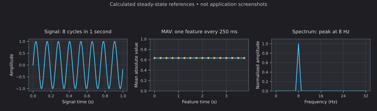
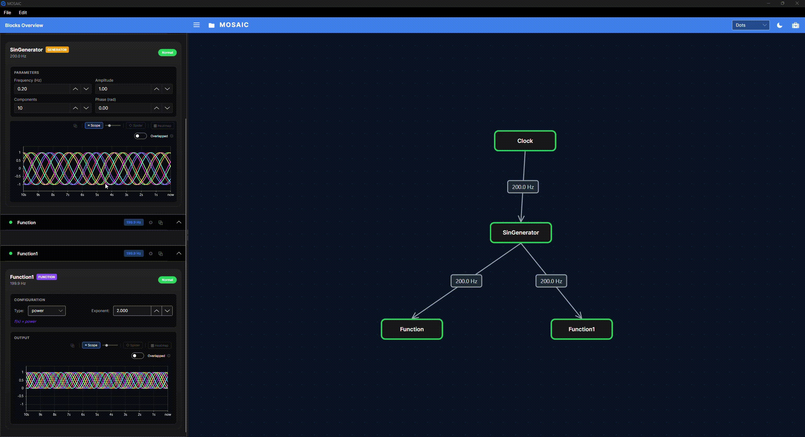

# Reading the plots

Use the [Signal Processing Walkthrough](signal-lab.md) so you know what each display should contain.
A plot is a view of data chosen by a block; it is not always a view of its published output.

## Find and compare the right view

1. Start the Clock and open the Signal card in the block controls panel.
2. Show **Scope** using the card's monitor toggle. Other blocks may offer different monitors.
3. Compare Signal with Filtered, then MAV. Wait at least two seconds for startup to settle.
4. Open Spectrum to inspect the FFT display. Its vertical positions represent frequencies,
   not extra signal channels.
5. Where available, use the monitor's settings, channel controls and desktop pop-out button.
   View controls do not start the source or change processing.

| Card in the signal processing example | What its visualization receives | Expected interpretation |
|---|---|---|
| Signal | Generated sample vectors | An 8 Hz sine wave. |
| Filtered | Filtered sample vectors | The sine after the low-pass filter. |
| Window | Incoming filtered data, before window weighting | A continuous input trace, not a drawing of every published window. |
| MAV | One computed feature vector per window | Approximately 0.63 at four updates/s. |
| Spectrum | Frequency-bin values | A strong component at 8 Hz; each new spectrum is a new time slice. |

The figure is a **calculated reference**, not a screenshot or a measurement of the UI.
Filtering adds phase delay and startup transients; the illustrated sine is the ideal input.

## Compare views in separate windows

On desktop, find the block in Blocks Overview and use its **Open in new window**
button to pop out the card. Move the window beside another block's view so you can
compare the same signal before and after processing. Close the window to return
the card to the overview. The standard visualization panel also offers a separate
pop-out for its plots. Separate windows are a desktop feature; they are not part
of the iOS workflow.

<figure class="workbench-demo">
  
  <a class="demo-animation" href="../images/workbench/pop-out.gif" target="_blank" rel="noopener">View full-size animation (new tab)</a>
  <figcaption>This desktop recording shows a Function card, including its controls and visualization, moving into a separate window and returning. It uses the teaching pipeline, whose block names and settings differ from the signal processing example.</figcaption>
</figure>

The small slider beside a monitor toggle changes the plot's **height on screen**.
It does not change the sample rate, processing window or visible time span. Use the
monitor's own settings for the available history and axis controls.

## Choose a monitor

| View | Useful for | What to check |
|---|---|---|
| Scope | Values changing over time | Selected channels, time span and vertical scale. |
| Spider | Comparing current channel magnitudes | Axis/channel ordering and value scale; it is not a history plot. |
| Standard Heatmap | A compact view of channel values/history | The feed chosen by the block; generic matrix feeds supply the last row. |
| FFT/Spectrogram | Frequency content over successive windows | Sample rate, FFT size, scaling and selected channel. |
| Projection/probability charts | Learned coordinates or class scores | Model state and class/component meaning. |

The standard visualization bundle sends the last row of a matrix to Spider and Heatmap.
It does not interpret an arbitrary matrix as an image automatically. Image blocks may
use specialized visualization paths.

## Channel layout, scaling and history

With several channels, **overlapped** mode draws traces on common axes. **Stacked** mode
adds vertical offsets to separate them. Those offsets are display spacing, not changes
to recorded values. Automatic vertical scaling can make two different amplitudes look
similar, so compare axis values or use consistent settings.

A display time span determines how much history is visible. It does not change the
source's acquisition rate or Sliding Window's BufferSize. Changing the channel count or
buffer sizing can rebuild the display and clear its history.

Hiding or pausing a monitor does not pause processing or recording. Returning to a view
does not promise recovery of every sample produced while it was hidden. Desktop pop-outs
and the aggregate Scope Monitor can mirror a block's actual scope feed; that feed can
differ from the block's published payload.

## How rows become plotted time

For a configured sample stream, the Scope advances its horizontal coordinate by one
sample period per **accepted row**. At 256 samples/s that is about 3.906 ms. A MAV
feature stream at four points/s advances by 250 ms per point.

An explicitly declared visualization sample rate takes priority. Otherwise the standard
bundle derives a rate from publication rate × rows fed to it. For a one-row feature,
that is the feature publication rate. The plotting axis is sample-count-based elapsed
time; it does not plot each CSV publication timestamp.

The visualization bundle can keep only the non-overlapping tail of a windowed matrix
when a block developer declares its output rate through `Viz.UpdateDesiredRate`. With
256 rows and stride 64, that would be 64 rows per update. No block in the current
catalogue enables it, it is not detected by comparing sample values, and it is not
needed for the MAV output.

## Display limits that matter

Scope is a live inspection tool. Its display path can accept fewer rows than were processed:

- Individual vector feeds pass through an arrival-time throttle with a minimum interval
  of 1 ms. At high sample rates, or when callbacks arrive in bursts, some can be omitted.
- Matrix feeds bypass that throttle, but batches larger than 4,096 rows are reduced.
- Channel setup, finite buffers and pause/visibility also affect what is retained.

These mechanisms are separate from overlap trimming. In the current implementation,
the configured per-point time step does not automatically establish the original timing
of samples removed by every display-reduction path. Compare a known signal and recording
before interpreting scope duration as wall-clock acquisition duration. The automated
documentation checks verify rate declarations and processing, not rendered timing.

## If the picture is unexpected

| Symptom | First check | Expected result in the signal processing example |
|---|---|---|
| No trace | Clock Play, plot visibility and loaded connections | Signal publishes while the Clock runs. |
| MAV starts near zero | Startup padding and filter settling | Approaches 0.63 after history fills. |
| MAV is nearly flat | It measures amplitude over complete cycles | Flat is correct for this constant-amplitude sine. |
| Spectrum absent | Window row count | 256 rows is valid; a non-power-of-two count is rejected. |
| FFT peak at the wrong frequency | Original sample rate and bin spacing | 1 Hz per bin, peak at 8 Hz. |
| Trace looks repeated or advances strangely | Actual card feed, batching, optional trimming and display limits | Compare the source recording before changing sample-rate settings. |
| Scope and CSV have different row counts | Display selection versus full publication recording | Window CSV preserves all 256 rows per publication. |

Continue with [Recording](recording.md) or the [learning experiment](learning-lab.md).
