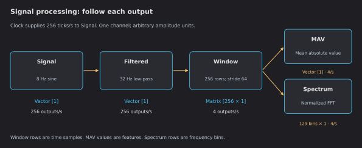

# Signal Processing Walkthrough

Generate a sine wave, filter it, measure its amplitude and inspect its frequencies.
This walkthrough shows what each block does and what you should see at its output,
then explains how to record the results. You can follow it on desktop without a sensor
or Python environment.
Start with [Your First Pipeline](first-pipeline.md) if opening and connecting blocks is new to you.

## 1. Open the complete experiment

[Download signal-lab.json](../examples/signal-lab.json), open it with **File → Open**,
and check that all six blocks and five connections loaded. Open the **Clock** card and
press **Play**. The file deliberately specifies all processing settings.

| Block | Setting | Purpose |
|---|---|---|
| Clock | 256 ticks/s | Drives one generated sample per tick. |
| Signal | One channel, amplitude 1, frequency 8 Hz | A known waveform for checking the result. |
| Filtered | Lowpass, IIR, 32 Hz cutoff, order 4 | Passes the 8 Hz component while attenuating higher frequencies. |
| Window | 256 rows, stride 64, Rectangular | Supplies one second of history, updated every quarter second. |
| MAV | No parameters | Computes one mean absolute value from each window. |
| Spectrum | Rectangular, MagnitudeNormalized | Converts each window into 129 frequency-bin values. |

“8 Hz” is the sine frequency. “256 samples/s” is how often it is sampled.
There are 32 samples per sine cycle. Values in this synthetic experiment have arbitrary units;
they are not calibrated volts or EMG units.

## 2. Check the output at each stage

Give the filter and windows at least two seconds of signal to settle. Inspect the cards
in this order. [Reading the plots](reading-plots.md) explains which data each card displays.

| Checkpoint | Published data | Expected result after settling |
|---|---|---|
| Signal | Vector with one channel, 256 times/s | Sine wave near −1 to +1. |
| Filtered | Vector with one channel, 256 times/s | Same main frequency, nearly the same amplitude, with phase delay. |
| Window | 256 × 1 matrix, 4 times/s | One second of filtered samples per matrix. Its own Scope displays the incoming filtered stream. |
| MAV | Vector with one feature, 4 times/s | Approximately 0.63; small variation is normal. |
| Spectrum | 129 × 1 matrix, 4 times/s | Largest non-DC peak at bin 8 = 8 Hz, normalized amplitude approximately 1. |

MAV is the average of the absolute values, not the average of the signed sine wave.
The continuous-sine reference is 2/π ≈ 0.637; finite sampling and filtering account for
the small difference. The feature trace is almost flat because every settled window
contains eight full cycles.

The FFT uses 256 samples at 256 samples/s: bin spacing is **1 Hz**, covering 0 through
128 Hz. It requires a power-of-two row count, such as 128, 256 or 512. A 400-row
window is not accepted by this FFT implementation.

## 3. Understand startup and overlap

Sliding Window initially fills its history with **255 zero rows**, then appends the first
real sample and publishes immediately. Subsequent publications occur every 64 new rows.
The first windows therefore mix real data and startup padding. Wait for at least one
second of samples before treating a window as a full history; allow additional settling
time after starting or changing the filter.

Once settled, adjacent windows share 192 rows. This is deliberate history reuse.
The full matrix reaches both MAV and FFT. They recompute their result for each window;
MAV publishes only one value, so its scope does not replay the window's 192 old samples.

## 4. Change one setting and predict the result

Pause the Clock before changing configuration. For settings not exposed by a card,
save a copy and edit its JSON, then reopen it.

| Change | Prediction |
|---|---|
| Signal amplitude 1 → 3 | The waveform amplitude triples; MAV approaches 1.90; normalized FFT peak approaches 3. |
| Window stride 64 → 256 | No overlap. MAV and FFT update once/s; sample spacing and FFT bin spacing stay unchanged. |
| Window size 256 → 128, keeping stride 64 | Half a second of history; still four updates/s; FFT bin spacing becomes 2 Hz. |
| Lower the filter cutoff below 8 Hz | The sine, MAV and spectral peak become smaller. |

After changing amplitude, wait for two seconds of new data before judging the result.
Change it back to 1 before the recording exercise.

Keep the stateful Filter **before** Sliding Window. Feeding overlapping windows through
a stateful time-domain filter makes it process retained history again. If you want a
tapered FFT window, apply it in one place: leave Sliding Window Rectangular and select
Hann in FFT. Tapering both multiplies two weighting functions and changes amplitudes.

## 5. Record and check the result

Choose a recording folder, tick **Record to CSV** in the settings menu of Signal, Window, MAV and Spectrum,
then run a short trial. Stop the source and turn Record off to close the files.
[Reading recorded data](recording.md#read-and-interpret-the-csv) shows their different layouts.

In ten seconds of steady operation, nominal counts are approximately 2,560 Signal
rows, 40 MAV rows, 40 windows (10,240 matrix rows) and 40 spectra (5,160 matrix rows).
Recording boundaries, source scheduling and queue loss can change these counts;
they are a sanity check, not a deadline or losslessness guarantee.

## What this example verifies

The documentation tests load the downloadable graph and exercise the actual processing
blocks, checking startup padding, shapes, rate metadata, settled MAV and FFT peak.
They also check CSV layout and the learning blocks. They run without chart rendering:
screen refresh, device performance and high-rate display timing require separate observation.

Continue with [Data and time](data-and-time.md), [Reading the plots](reading-plots.md),
or [Train a simple classifier](learning-lab.md).
