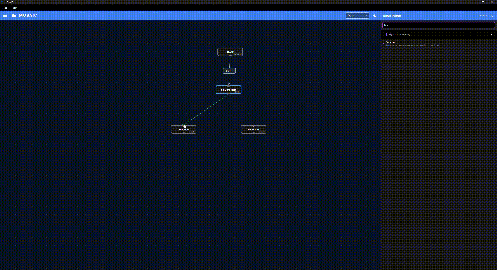
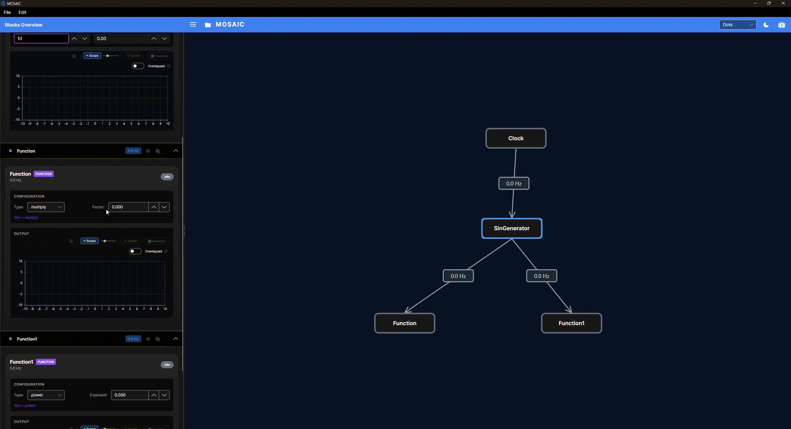

# Using the workbench

The workbench is where you assemble and run an experiment. This guide shows where
to find its controls and how adding a block, connecting it and starting it fit together.
If MOSAIC is not running yet, begin with [Getting Started](getting-started.md).

## Find your way around

The recordings on this page come from a desktop teaching session. They demonstrate
the controls; block names and settings can differ from the downloadable tutorials.
Select **Play animation** to watch a demonstration, and **Stop animation** to return
to its still image. Use **View full-size animation** to open the original recording
in a new tab, where you can enlarge it to read the controls. The written steps also
explain each action.

| Area | What you do there |
|---|---|
| Top toolbar and File menu | Open a pipeline or save your arrangement and settings. |
| Centre: canvas | Place blocks and connect their ports to define where data goes. |
| Right: block palette | Find an available block and add an instance to the experiment. |
| Left: Blocks Overview | Expand a block's card to change settings, operate it or show its available plots. |

The canvas and cards refer to the same blocks. Moving a node makes the graph easier
to read; changing a parameter changes what that block does. A plot shows the data
selected for that block's visualization.

## Open an existing experiment

Choose **File → Open**, or the folder button, and select a pipeline JSON file.
For a hardware-free starting point, use the example in [Your First Pipeline](first-pipeline.md).
Check that the expected blocks and connections loaded before starting the source.
Resolve loading errors first: a partially loaded graph may not represent the intended experiment.

Opening a pipeline restores its setup. For a clock-driven example, you still need
to press Play in the Clock card. Device-based experiments also need a live device
connection; reopening a file does not establish that connection for you.

## Add a block

1. Pause the source while changing the graph.
2. Find the operation in the right-hand palette. Use the [Block Catalogue](block-catalogue.md)
   when you need to check its purpose, parameters or required inputs.
3. Drag the operation onto the canvas. Give the new block a distinct name and confirm
   the settings in the creation dialog.
4. Find the resulting node on the canvas and its controls in Blocks Overview.

Adding an instance gives it a place in the experiment; connecting that instance to
its input data is a separate step. The palette reflects the current platform and
build options, so optional device blocks may not appear.

## Connect it to the data it needs

In the graph's build mode, drag from an upstream block's **bottom output port** to
the next block's **top input port**. The dashed line follows the pointer during the
drag. A completed connection means that values published upstream are passed to
the receiving block. One output can feed several downstream blocks.

<figure class="workbench-demo">
  
  <a class="demo-animation" href="../images/workbench/connect-blocks.gif" target="_blank" rel="noopener">View full-size animation (new tab)</a>
  <figcaption>Follow the port-to-port drag. In the completed graph, the generator supplies two Function blocks so their transformations can be compared.</figcaption>
</figure>

Check the receiving block's input requirements. Acceptance by the editor does not
guarantee that the values have the right shape or meaning. For example, a feature
calculation may need a window of samples, while another operation needs one vector.
The block reference explains these requirements; [Data Shapes and Time](data-and-time.md)
explains how the forms differ.

## Change settings and start the source

Expand the appropriate card in **Blocks Overview**. Controls depend on the block:
a Clock has a rate and Play/Pause controls; a signal generator has waveform settings;
a Function exposes settings for its selected operation, such as a multiplication factor.
Apply the change if the control provides an Apply action, then resume the source.

<figure class="workbench-demo">
  
  <a class="demo-animation" href="../images/workbench/block-controls.gif" target="_blank" rel="noopener">View full-size animation (new tab)</a>
  <figcaption>Watch the left-hand cards and the Clock's controls. In this example the Clock supplies ticks that drive the connected generator.</figcaption>
</figure>

For this clock-driven graph, pausing the Clock stops new generated samples.
Other source blocks can have their own connection or start controls. The Clock is
not a universal start/stop switch for independent network streams or workers.

Inspect the source first, then follow the connections downstream. A displayed rate
or a green connection alone does not prove that a sensor is supplying fresh,
meaningful measurements. Check the connection status and the values themselves.

## Compare results, then save

Show a card's **Scope** or another available monitor to inspect its data. On desktop,
the pop-out control lets you move a view into a separate window for comparison.
See [Reading the Plots](reading-plots.md#compare-views-in-separate-windows) for a demonstration.
Some blocks have no dedicated plotting card.

Use **File → Save As** to keep your experiment setup. Recording numerical data is
a separate action: choose what to record and where to save it as described in
[Recording and Saved Pipelines](recording.md). Saving the graph does not save the
whole live session, plot history or every block's learned state.

Continue with [Your First Pipeline](first-pipeline.md) for an exercise with specific
settings and expected results.
